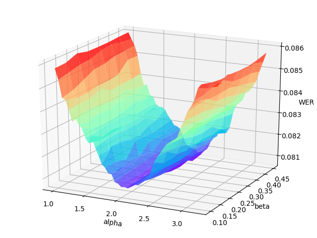

# 语音识别: zyasr
*zyasr*是一个采用在[PaddlePaddle]平台的端到端自动语音识别（ASR）引擎
愿景是为语音识别在医疗行业，提供易于使用、高效和可扩展的工具，包括自动标注，自我训练，推理，测试模块，以及 快速 部署。

## 目录
- [目标](#目标)
- [准备](#准备)
- [预训练模型](#预训练模型)
- [计划](#计划)
- [新增功能](#新增功能)
- [下阶段目标](#下阶段目标)


## 目标
1. 训练过语音模型的字错率(正确数/总字数)
2. 未训练过语音模型的字错率(正确数/总字数)
3. 高并发服务器语音解析性能(吞吐量)

## 准备
1.请确保以下库或工具已安装完毕：`xshell`, `filezliia`, `notepad++`,  可以在tools文件夹中找到安装文件。
```
  服务器地址：192.168.0.60
  系统用户名：mxl
  系统密码：mxl
  ftp用户名：sunftp
  ftp密码：zhiying
 ```
2. 工具使用说明
```
  cd /mnt/md0/opt/tools
  ls -l
  1.asr_start.sh---启动相关服务：kafka，asr引擎，nlp引擎，zookeeper，ak工作流
  2.asr_stop.sh---停止相关服务：同上
  3.status.sh   ---查看目前asr执行状况，包括未解析记录数，总共要解析记录数
  4.cd /mnt/md0/opt/tools/log/process  ------可以全程查看整个流程处理过程
```
3. 相关执行脚本
```
1.启动业务引擎生产者服务
kafka-console-producer.sh --broker-list deepspeed:9092 --topic next
2.启动业务引擎消费者服务
3.kafka-console-consumer.sh --bootstrap-server deepspeed:9092 --from-beginning --topic send
4.启动asr消费者服务
kafka-console-consumer.sh --bootstrap-server deepspeed:9092 --from-beginning --topic next
````
## 预训练模型
```
cd /mnt/md0/opt/DeepSpeech/dataset/aishell/data_aishell/wav
其中dev,test,train三个目录下存放已经训练好的数据，可自行编辑
```
## 计划
参看plan目录

## 新增功能
|  序号  | 时   间  | commit | 内容 |
| ------ | -------   | ----------   | -----------|
| 1       |  2019-12-17 | 马路 | 对核心流程日志跟踪功能 |
| 2       |  2019-12-17 | 马路 | 性能测试邮件提醒功能 |
## 下阶段目标
- 增加nlp同义词模糊比较
- 增加通过热词(表单标签+内容)的积累，使用word2vector模型训练，进行语义推测。
- 增加自训练机制(自我标注--自我训练--网格--误差曲面绘制)
<p align="center">
<br/>
<br/>
</p>

## FAQ
欢迎到 [Github Issues](https://github.com/maxiaolu19710219/asr-test/issues)记录bug
欢迎到 [Github wiki  ](https://github.com/maxiaolu19710219/asr-test/wiki)提出问题


